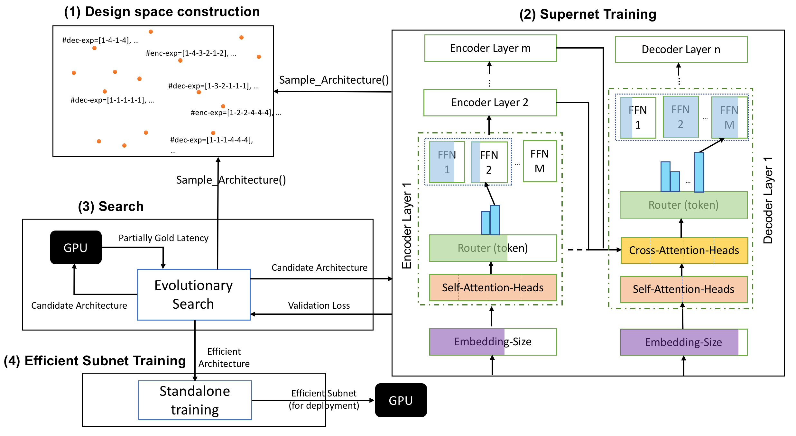

# AutoMoE: Neural Architecture Search for Efficient Sparsely Activated Transformers

This repository contains code, data and pretrained models used in [AutoMoE (pre-print)](https://arxiv.org/abs/2210.07535). This repository builds on [Hardware Aware Transformer (HAT)'s repository](https://github.com/mit-han-lab/hardware-aware-transformers).

## AutoMoE Framework


## AutoMoE Key Result

The following table shows the performance of AutoMoE vs. baselines on standard machine translation benchmarks: WMT'14 En-De, WMT'14 En-Fr and WMT'19 En-De.

| WMT’14 En-De         | Network | \# Active Params (M) | Sparsity (%) | FLOPs (G) | BLEU  | GPU Hours  |
|----------------|--------|---------|------|------|------|------|
| Transformer | Dense | 176 | 0 | 10.6 | 28.4 |  184 |
| Evolved Transformer | NAS over Dense | 47 | 0 | 2.9 | 28.2 | 2,192,000 |
| HAT | NAS over Dense | 56 | 0 | 3.5 | 28.2 | 264 |
| AutoMoE (6 Experts) | NAS over Sparse | 45 | 62 | 2.9 | 28.2 | 224 | 

| WMT’14 En-Fr         | Network | \# Active Params (M) | Sparsity (%) | FLOPs (G) | BLEU  | GPU Hours  |
|----------------|--------|---------|------|------|------|------|
| Transformer |  Dense | 176 | 0 | 10.6 | 41.2 | 240 |
| Evolved Transformer | NAS over Dense | 175 | 0 | 10.8 | 41.3 | 2,192,000  |
| HAT | NAS over Dense | 57 | 0 | 3.6 | 41.5 | 248 |
| AutoMoE (6 Experts) | NAS over Sparse | 46 | 72 | 2.9 | 41.6 | 236  |
| AutoMoE (16 Experts) | NAS over Sparse | 135 | 65 | 3.0 | 41.9 | 236 | 

| WMT’19 En-De        | Network | \# Active Params (M) | Sparsity (%) | FLOPs (G) | BLEU  | GPU Hours  |
|----------------|--------|---------|------|------|------|------|
| Transformer |  Dense | 176 | 0 | 10.6 | 46.1 | 184 |
| HAT | NAS over Dense | 63 | 0 | 4.1 | 45.8 | 264 |
| AutoMoE (2 Experts) | NAS over Sparse | 45 | 41 | 2.8 | 45.5 | 248  |
| AutoMoE (16 Experts) | NAS over Sparse | 69 | 81 | 3.2 | 45.9 | 248 | 


## Quick Setup

### (1) Install
Run the following commands to install AutoMoE:
```bash
git clone https://github.com/UBC-NLP/AutoMoE.git
cd AutoMoE
pip install --editable .
```

### (2) Prepare Data
Run the following commands to download preprocessed MT data:
```bash
bash configs/[task_name]/get_preprocessed.sh
```
where `[task_name]` can be `wmt14.en-de` or `wmt14.en-fr` or `wmt19.en-de`.

### (3) Run full AutoMoE pipeline
Run the following commands to start AutoMoE pipeline:
```bash
python generate_script.py --task wmt14.en-de --output_dir /tmp --num_gpus 4 --trial_run 0 --hardware_spec gpu_titanxp --max_experts 6 --frac_experts 1 > automoe.sh
bash automoe.sh
```
where,
* `task` - MT dataset to use: `wmt14.en-de` or `wmt14.en-fr` or `wmt19.en-de` (default: `wmt14.en-de`)
* `output_dir` - Output directory to write files generated during experiment (default: `/tmp`)
* `num_gpus` - Number of GPUs to use (default: `4`)
* `trial_run` - Run trial run (useful to quickly check if everything runs fine without errors.): 0 (final run), 1 (dry/dummy/trial run) (default: `0`)
* `hardware_spec` - Hardware specification: `gpu_titanxp` (For GPU) (default: `gpu_titanxp`)
* `max_experts` - Maximum experts (for Supernet) to use (default: `6`)
* `frac_experts` - Fractional (varying FFN. intermediate size) experts: 0 (Standard experts) or 1 (Fractional) (default: `1`)
* `supernet_ckpt` - Skip supernet training by specifiying checkpoint from [pretrained models](https://1drv.ms/u/s!AlflMXNPVy-wgb9w-aq0XZypZjqX3w?e=VmaK4n) (default: `None`)
* `latency_compute` - Use (partially) gold or predictor latency (default: `gold`)
* `latiter` - Number of latency measurements for using (partially) gold latency (default: `100`)
* `latency_constraint` - Latency constraint in terms of milliseconds (default: `200`)
* `evo_iter` - Number of iterations for evolutionary search (default: `10`)

## Contact
If you have questions, contact Ganesh (`ganeshjwhr@gmail.com`), Subho (`Subhabrata.Mukherjee@microsoft.com`) and/or create GitHub issue.

## Citation
If you use this code, please cite:
```
@misc{jawahar2022automoe,
      title={AutoMoE: Neural Architecture Search for Efficient Sparsely Activated Transformers}, 
      author={Ganesh Jawahar and Subhabrata Mukherjee and Xiaodong Liu and Young Jin Kim and Muhammad Abdul-Mageed and Laks V. S. Lakshmanan and Ahmed Hassan Awadallah and Sebastien Bubeck and Jianfeng Gao},
      year={2022},
      eprint={2210.07535},
      archivePrefix={arXiv},
      primaryClass={cs.CL}
}
```

## License
See LICENSE.txt for license information.

## Acknowledgements
* [Hardware Aware Transformer](https://github.com/mit-han-lab/hardware-aware-transformers) from `mit-han-lab`
* [fairseq](https://github.com/facebookresearch/fairseq) from `facebookresearch`

## Trademarks

This project may contain trademarks or logos for projects, products, or services. Authorized use of Microsoft 
trademarks or logos is subject to and must follow 
[Microsoft's Trademark & Brand Guidelines](https://www.microsoft.com/en-us/legal/intellectualproperty/trademarks/usage/general).
Use of Microsoft trademarks or logos in modified versions of this project must not cause confusion or imply Microsoft sponsorship.
Any use of third-party trademarks or logos are subject to those third-party's policies.
